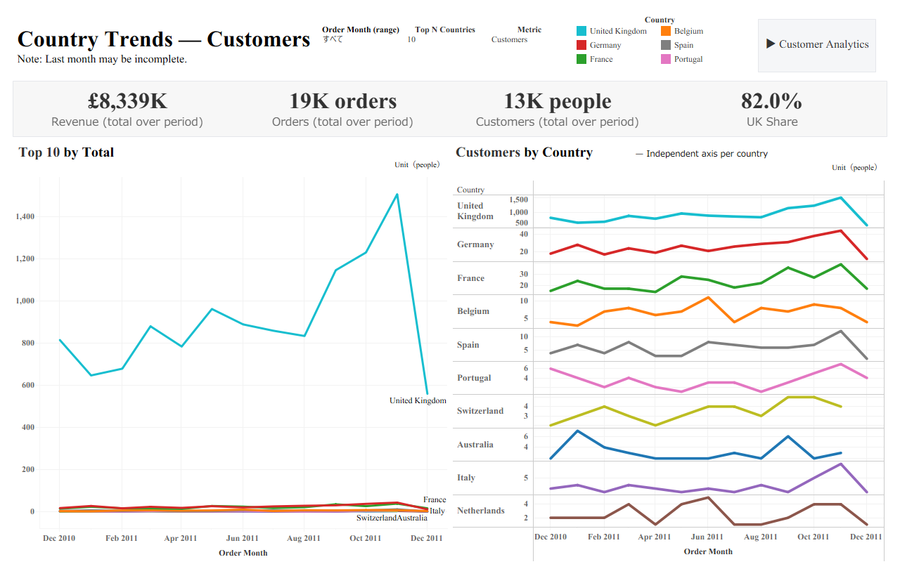
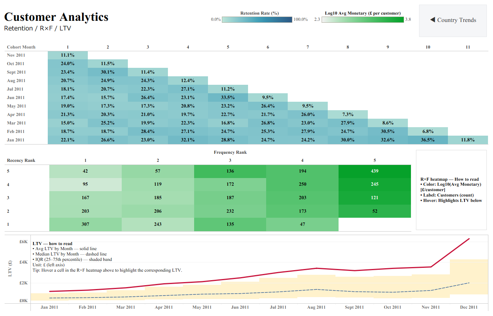
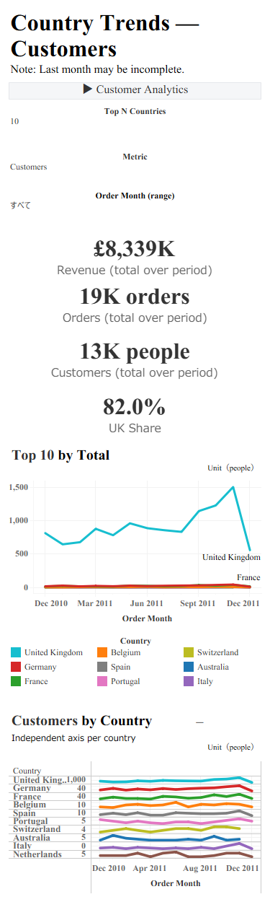
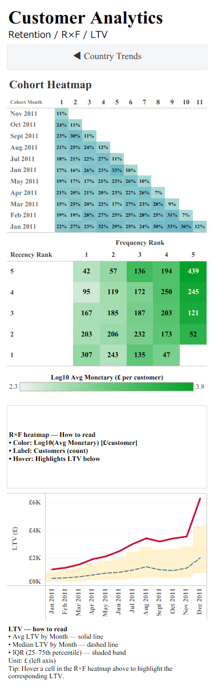

# Online Retail 2011 — Project Docs
**Purpose:** Build a reproducible Python → Tableau pipeline to explore country trends and customer value (cohort, R×F, LTV) from the UCI Online Retail 2011 dataset.  
**At a glance:** Revenue is highly UK-centric and LTV trends upward; hovering the R×F heatmap pinpoints high-value segments. (The last month may be incomplete.)

This folder contains short documentation for the project and a link to the live dashboards.

---

## 0) Environment
- **OS**: Windows 11 / macOS 14 (either works)
- **Python**: 3.11.9
- **Tableau Desktop**: 2025.2 or later

### Python packages (pinned)
`requirements.txt` is included:
```
pandas==2.2.2
pyarrow==16.1.0
numpy==1.26.4
```

### Setup

```powershell
# Windows PowerShell
python -m venv .venv
.\.venv\Scripts\Activate.ps1
pip install -r requirements.txt
```

```bash
# macOS / Linux
python3 -m venv .venv
source .venv/bin/activate
pip install -r requirements.txt
```

---

## 1) Project layout

```text
analytics-lab/
└─ projects/
   └─ ecom-online-retail-2011/
      ├─ data/
      │  ├─ raw/                      # raw CSV (e.g., Online Retail.csv)
      │  └─ processed/                # generated outputs
      │     ├─ transactions.parquet
      │     ├─ cohort_retention.csv
      │     ├─ rfm_features.csv
      │     ├─ ltv_customer_month.csv
      │     └─ channel_month.csv
      ├─ dashboards/
      │  ├─ tableau/
      │  │  ├─ 01_Country_Trends.twbx
      │  │  ├─ 02_EC_Core_Overview.twbx
      │  │  └─ 03_EC_Core_Customer.twbx
      │  └─ img/                      # screenshots for README/Docs
      ├─ docs/
      │  ├─ README.md                 # this file
      │  └─ data_dictionary.md
      ├─ notebooks/
      ├─ scripts/
      │  └─ 01_build_transactions.py
      ├─ sql/
      └─ requirements.txt
```

---

## 2) Quick start

### 2.1 Place raw data
Put the raw CSV under `data/raw/`.
Example columns: `InvoiceNo, InvoiceDate, CustomerID, Country, StockCode, Description, Quantity, UnitPrice`.

### 2.2 Build processed files
```bash
python scripts/01_build_transactions.py
```

Outputs in `data/processed/`:
- `transactions.parquet` — line items (order × product)
- `cohort_retention.csv` — active users by cohort/index
- `rfm_features.csv` — per-customer R/F/M with scores
- `ltv_customer_month.csv` — per-customer monthly cumulative LTV
- `channel_month.csv` — monthly revenue/orders/customers by country

### 2.3 View dashboards
Open the packaged workbooks in Tableau (`.twbx` includes data):
- `dashboards/tableau/01_Country_Trends.twbx`
- `dashboards/tableau/02_EC_Core_Overview.twbx`
- `dashboards/tableau/03_EC_Core_Customer.twbx`

---

## 3) Data cleaning rules
- Drop returns: `InvoiceNo` starts with "C"
- Keep only `Quantity > 0` and `UnitPrice >= 0`
- Drop missing `CustomerID`
- Derived fields:  
  `revenue = Quantity * UnitPrice`  
  `order_date = DATE(InvoiceDate)`  
  `order_month = month start of InvoiceDate`  
  `customer_id = str(int(CustomerID))`, `country = str(Country)`

---

## 4) Dashboards

**01. Country Trends — Customers**  
- KPIs: Revenue / Orders / Customers / UK Share  
- Left: total time series (absolute)  
- Right: small multiples per country (independent axes)  
- Parameters: `Metric`, **Top N Countries** *(used only here)*

**02. Customer Analytics — Cohort · R×F · LTV**  
- Cohort heatmap: Retention Rate (%) × Cohort Index  
- R×F heatmap: Color = `log10(Avg Monetary £/customer)`, Label = `Customers (count)`  
- LTV: Average (solid), Median (dashed), IQR (band)  
- Action: Hover on R×F → highlight corresponding LTV  
- Note: Don’t place “Top N Countries” here (keeps interactions stable)

---

## 5) Deliverables

### Live dashboards (Tableau Public)
Default tab: Country Trends  
https://public.tableau.com/app/profile/.54894359/viz/OnlineRetail2011CountryCustomerAnalytics/CountryTrendsCustomers

### Screenshots
Images live in `dashboards/img/` and are referenced below:

- 
- 

<details><summary>Mobile layout</summary>

-   
- 

</details>

---

## 6) Metric definitions (excerpt)
(See `docs/data_dictionary.md` for full list.)
- Revenue (£) = Σ(Quantity × UnitPrice)
- Orders = COUNTD(InvoiceNo)
- Customers = COUNTD(customer_id)
- UK Share (%) = UK / total revenue over the selected period
- Retention Rate = active_users / base_users
- Avg/Median LTV (£) = aggregated from `ltv_customer_month`
- IQR = 25th–75th percentile band

---

## 7) Script
- File: `scripts/01_build_transactions.py`  
- Role: ingest raw → clean → generate aggregates  
- Input: `data/raw/*.csv`  
- Output: `data/processed/*.csv`, `*.parquet`

---

## 8) Troubleshooting
- CSV not found → ensure a CSV exists under `data/raw/`
- UnicodeDecodeError → keep `encoding="unicode_escape"` on read
- Tableau path broken → if using live `.twb`, re-point to `data/processed/`
- R×F → LTV not highlighting → empty cells are expected; also ensure **Recency Rank / Frequency Rank** are on LTV Detail

---

## 9) Ops notes
- Use leading numbers (`01_*`) to clarify run order
- Keep `.venv/` out of Git; reproduce env via `requirements.txt`
- Don’t commit data (`data/raw`, `data/processed` in `.gitignore`)

---

## 10) License & credits
- Data source: https://archive.ics.uci.edu/dataset/352/online+retail  
- License: **CC BY 4.0** (reuse permitted with attribution)  
- Citation: Chen, D. (2015). *Online Retail* [Dataset]. UCI Machine Learning Repository. https://doi.org/10.24432/C5BW33  
**Note**: Raw data is **not re-distributed** in this repo. Please download from UCI and place under `data/raw/`.

---

## Changelog
- 2025-08-22: Initial release (preprocessing + 3 dashboards)
